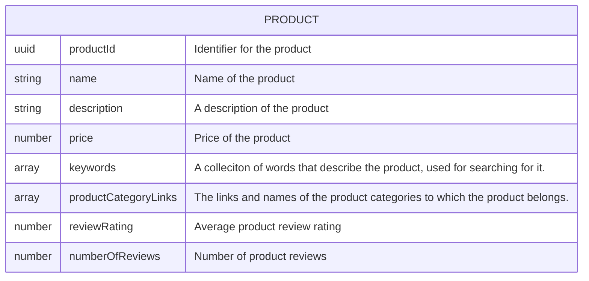
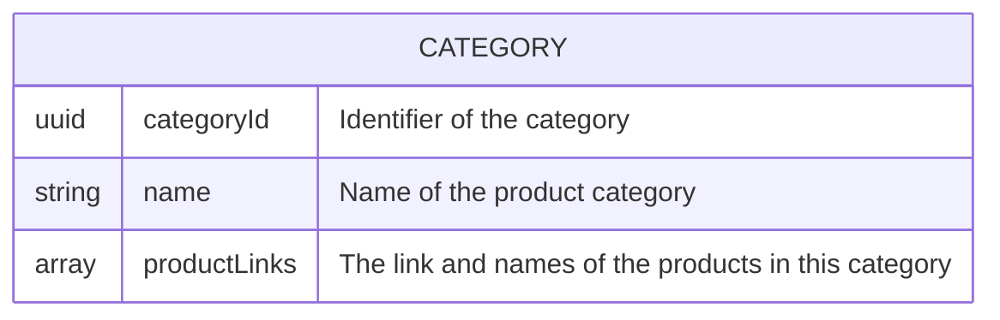
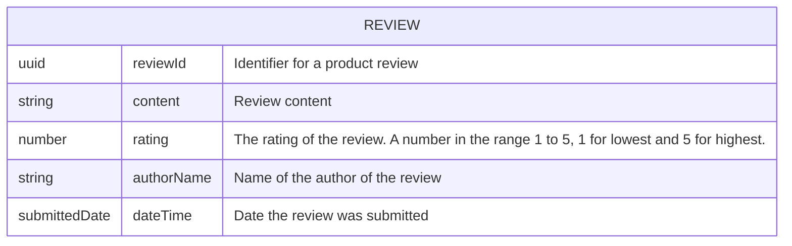
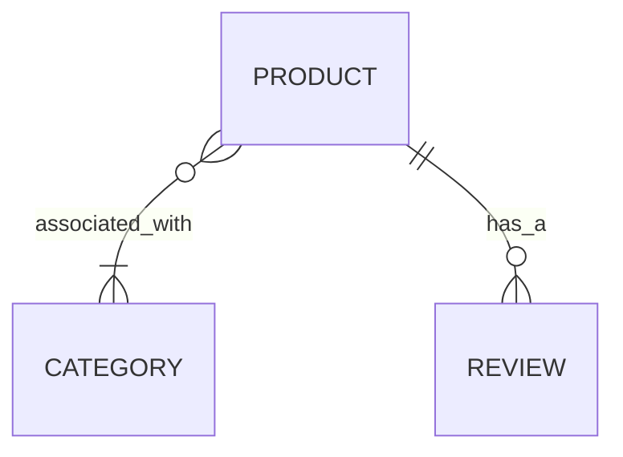
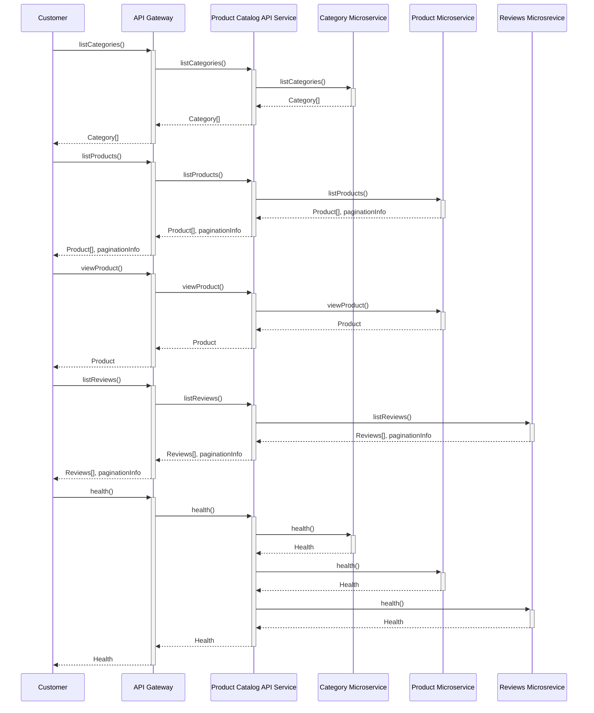

# API Model

## API Operations

| Digital capability  | Operation Name | Operation Description     | Participant | Web Resource | Request                                                                 | Response                   | HTTP Method | Resource Path         | Response Code |
| ------------------- | -------------- | ------------------------- | ----------- | ------------ | ----------------------------------------------------------------------- | -------------------------- | ----------- | --------------------- | ------------- |
| Browse catalog | listCategories | List all categories      | Customer    | Category     | Filter by field, sort by field, order direction, page size, page cursor  | Category[], PaginationInfo | GET         | /categories           | 200            |
| Browse catalog | listProducts   | List all products        | Customer    | Product      | Filter by field, sort by field, order direction, page size, page cursor  | Product[], PaginationInfo  | GET         | /products             | 200            |
| Browse catalog | viewProduct    | View a product's details | Customer    | Product      | Product ID                                                               | Product                    | GET         | /products/{productId} | 200            |
| Browse catalog | listProductReviews| List all reviews for a product| Customer| Review   | Filter by field, sort by field, order direction, page size, page cursor  | Reviews[], PaginationInfo  | GET         | /products/{productId}/reviews | 200    |
| Browse catalog | viewReview    | View a product review     | Customer    | Review       | Product ID, Review ID                                                    | Reviews[], PaginationInfo  | GET         | /products/{productId}/reviews/{reviewId} | 200    |

## Web Resources

A category is a class of products with common characteristics. A category can contain zero or more products.
A product is an item for sale on the store. A product belongs to at least one category and has zero or more reviews.
A review is a critical assesment of a product by a customer. A revivew is associated to one and only one product.

## Web Resource Relationships

## API Sequence diagram

